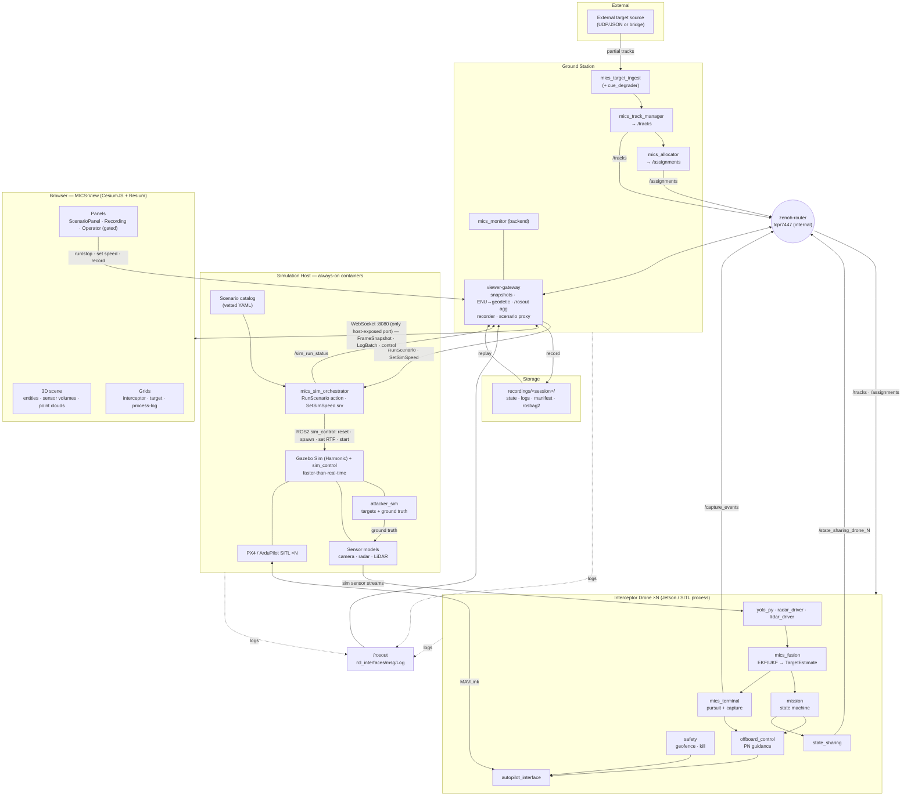

# MICS — Multi-Drone Cooperative Interception System

A simulation-first development project for a **counter-UAV (C-UAV) system using non-kinetic, capture-based interception**. Ground-cued interceptor drones cooperatively pursue and attempt to **capture** targets; on a failed attempt the team reassigns to another interceptor. Built on the open-source **aerial-autonomy-stack** (PX4/ArduPilot + ROS2 + Gazebo + YOLO/LiDAR + Jetson), with a browser-based 3D viewer for situational awareness, recording, and scenario control.

> **Framing:** all terminal behaviour ends at pursuit + capture (e.g. net capture). No kinetic capability. Live flight is range-authorised only; the bulk of work is in simulation.

---

## Documents (what owns what)

| Document | Owns |
|---|---|
| **[PRD_multidrone_interception.md](./PRD_multidrone_interception.md)** | The system: CONOPS, autonomy (onboard state machine, fusion, terminal pursuit/capture), cooperative allocation/reassignment, ground station, simulation (attackers/defenders/sensors), dev environment (incl. CPU-only profile), the shared `mics_msgs` contract, test plan, milestones. |
| **[PRD_viewer_architecture.md](./PRD_viewer_architecture.md)** | **MICS-View**, the browser 3D viewer (frontend of `mics_monitor`): CesiumJS scene, high-performance grids, the `viewer-gateway`, disk recording (incl. logs), replay, scenario selection + run/stop, and simulation-speed control. |

`mics_msgs` is the single shared interface contract across both docs. The scenario catalog, ENU datum, and the non-kinetic framing are also shared.

---

## Complete system

---

## Major components

| Component | Where | Role |
|---|---|---|
| `attacker_sim` | Sim host | Spawns targets, drives trajectories (waypoint/ingress/evasive/replay), emits ground truth used only by sensor models + scoring. |
| Sensor models | Sim host | Camera, **radar (new)**, LiDAR with realistic noise/FOV/dropout, derived from ground truth. |
| PX4 / ArduPilot SITL | Sim host | Flight control per defender; lockstep enables faster-than-real-time. |
| `mics_sim_orchestrator` | Sim host | Commands the **always-on** sim over ROS2 (reset/spawn/RTF/start) for a run from the vetted catalog; exposes `RunScenario` + `SetSimSpeed`; publishes `SimRunStatus`. No `docker.sock`; sim-only. |
| `yolo_py` / `radar_driver` / `lidar_driver` | Onboard | Per-modality detection inputs. |
| `mics_fusion` | Onboard | EKF/UKF over camera+radar+LiDAR → `TargetEstimate` (drives handoff + failure logic). |
| `mission` | Onboard | State machine: IDLE→ASSIGNED→MIDCOURSE→ACQUIRING→TERMINAL→CAPTURED/FAILED. |
| `mics_terminal` | Onboard | Terminal pursuit (proportional navigation) + capture trigger + interlocks. |
| `offboard_control` / `autopilot_interface` | Onboard | Setpoint/guidance refs and high-level actions to the autopilot via MAVLink. |
| `state_sharing` / `safety` | Onboard | Broadcast pose+status+assignment; geofence/kill/interlocks (always on). |
| `mics_target_ingest` | GS | Normalise internal/external sources → `TargetTrack`; degrade cues in internal mode. |
| `mics_track_manager` | GS | Track association/aging/fusion → `/tracks`. |
| `mics_allocator` | GS | Roster + assignment (Hungarian) + reassignment on failure → `/assignments`. |
| `viewer-gateway` | GS | The choke point: per-frame snapshots, ENU→geodetic, `/rosout` aggregation, recording/replay, scenario-run proxy, auth boundary. |
| **MICS-View** | Browser | 3D scene + grids + panels; runs on browser WebGL (independent of the GPU-less sim host). |

---

## Shared interfaces (`mics_msgs`)

| Interface | Kind | Carried on | Purpose |
|---|---|---|---|
| `TargetTrack` | msg | `/tracks` | GS cues / fused tracks (with covariance, age). |
| `Assignment` | msg | `/assignments` | drone→target mapping (primary/standby). |
| `DroneStatus` | msg | `/state_sharing_drone_N` | pose, twist, state, target, battery, track quality. |
| `CaptureEvent` | msg | `/capture_events` | attempt/success/miss. |
| `ScenarioInfo` | msg | (catalog) | scenario descriptor for selection. |
| `SimRunStatus` | msg | `/sim_run_status` | run state, elapsed, counts, requested/achieved RTF. |
| `RunScenario` | action | `run_scenario` | launch a scenario (goal/feedback/result). |
| `SetSimSpeed` | srv | — | runtime real-time-factor change (SITL only, gated). |
| (logging) | `rcl_interfaces/msg/Log` | `/rosout` | standard ROS2 logs from all processes — **no custom message**. |

Transport: **Zenoh/DDS** inter-drone and drone↔GS; **WebSocket** gateway↔browser. Cross-machine `/rosout` is bridged with `zenoh-bridge-ros2dds`.

---

## Where to start (new engineer)

1. Read **PRD_multidrone_interception.md** §0–§1 (framing + CONOPS), then §4 (dev environment, incl. the **CPU-only laptop profile** in §4.5).
2. Stand up baseline AAS SITL (PRD §4.3). Then build the **coordination core with ideal/stub sensors** (PRD milestones P0–P2) — most of the system's behaviour lives here and needs no GPU.
3. For the UI, read **PRD_viewer_architecture.md** §6 (architecture: gateway, coordinate frames, recording, scenario orchestration) and start at viewer milestone **V0** against a recorded rosbag.
4. Treat full-perception, large swarms, and Jetson HITL as the things you offload to a GPU/edge device later.

## Safety & scope

Non-kinetic capture only. Scenario run/stop and operator controls are auth-gated and act on **simulation**, never real aircraft. Live flight requires range authorisation. See the risks/open-questions sections in both PRDs.
